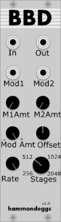

# Hammondeggs plugins for VCV Rack

Modules for [VCV Rack](https://github.com/VCVRack/Rack), an open-source Eurorack-style virtual modular synthesizer:

  - [BBD](#BBD) - Bucket Brigade Delay Emulator
  - [Phase3](#phase3) - 3 Phase (+180°) Sine/Tri oscillator (use with BBD to create choruses
  - [SID2CV](#sid2cv) - C64 SID player.
  - [COMBI](#combi) - C64 Combination Waveform Oscillator
  - [DIGIMOD](#digimod) - C64 SID style digital ring modulator
  - [SIDENV](#sidenv) - C64 SID accurate envelope generator (use with SID2CV, or your own control voltages)
  - [SIDLFSR](#sidlfsr) - C64 SID LFSR (linear feedback shift register) noise generator.


### <a name="BBD"></a> BBD



A bucket brigade style delay emulator.

Bucket brigade delay ICs were used in many effects from simple audio delays to choruses, flangers, and can even be wired for feedback for use as an oscillator!

BBD Circuits typically contained a fixed number of stages (256,512,1024,2048 are supported) that were clocked by a high speed external oscillator (sometimes even 1mhz or more), and the input signal would appear after *n* clock steps where *n* = the number of stages. This high speed oscillator is emulated as well, and much like a chorus or flanger, can be modulated by up to 2 external signals.

### Effect Parameters and I/O:
__IN__ : Signal Input. While the current 1.0 implementation of the BBD delay is DC coupled, this is primarily designed for audio signals.

__OUT__ : Signal Output.

__Mod1__ : External BBD Clock Rate modulation input #1. Mixed with Mod2

__Mod2__ : External BBD Clock Rate modulation input #2. Mixed with Mod1

__M1Amt__ : Level of Mod1 signal to use

__M2Amt__ : Level of Mod2 signal to use

__Mod Amt__ : Overall level of modulation. Consider the modulation inputs and this to be a mixer of sorts. Note however that you can turn this knob counter clockwise to invert the mixed signal.

__Amt Offset__ : Applies a DC offset to the mixed modulation signal. Useful if you wish to hard clip the modulation signal on one side

__Rate knob__: Overall BBD clock rate. This can be turned all the way to 0 hz. Low values result in low clock rates which, like the 'real' thing, can result in aliasing.

__Stages__ : Allows selection of a 256, 512, 1024 or 2048 stage delay.

### Uses

On it's own, it doesn't do much but to delay a signal ever so slightly. There (currently) isn't even a feedback knob. This allows you to determine exactly how this component will be used - you can easily use a mixer to add feedback if you like, or even place a filter or inverter or whatever module you like in the feedback. Note however that feedback is by all means not required to get a fantastic sound out of this module.

Using the [Phase3](#phase3) LFO module which is designed primarily for use with this BBD we can achieve some famous chourus sounds easily: 

For a "Roland®" style chorus: 

This uses 2 BBD delays, one for each channel with the delay time running from ONE LFO but they are 180° out of phase from each other. Mix the BBD outputs into hard left and right channels, with the original signal mixed into the centre channel. For better effect, invert the original signal. Use a triangle waveshape for the LFO

For a "Solina®" style triple BBD chorus (and many other string machines):

This uses 3 BBD delays (hence the name), and two modulation sources. One 'fast' (around 6 hz) and one 'slow' (around 1 or so hz, this can vary). Each BBD input receives the same source, and connect the 3 BBD delay outputs into a mixer for hard left, centre, and right. NO original signal is mixed.

The 3 delays must receive the LFO modulations 120 degrees out of phase with each other. Fortunately, the [Phase3](#phase3) LFO is designed just for this. Add 2 of these, (one for 'fast' and one for 'slow'), and connect the 3 phases from the 'fast' one to one of the modulation inputs on each BBD, and do the same for the slow one.


### <a name="phase3"></a> Phase 3

A simple LFO with variable waveshape from Sine to Triangle, which outputs the result in 4 phases. 


__Ø1__: Root phase ("Phase 1")(0°)

__Ø2__: Phase 2 (120°)

__Ø3__: Phase 3 (240°)

__180°__ : Phase 1 but inverted (180° out of phase)

__Rate Knob__ - Sets the oscillator rate

__Amount Knob__ - Sets the oscillator output level
__Shape Knob__ - Sets the oscillator output shape smoothly from sine to triangle

__Rate CV IN__ - Allows external control of the oscillator rate.


### <a name="sid2cv"></a> SID2CV


A .SID File Player for VCV Rack! (VCV Rack is © 2017 Andrew Belt)

## What this is!

This plugin for VCV rack allows you to play many of the .SID files in the [High Voltage Sid Collection](https://www.hvsc.c64.org/)! It does this by emulating the following portions of an NTSC C64:

6502 CPU<br> 
6526 CIA timer ICs (Song / sample playback support)<br>
PLA (memory mapping)<br>
SID : The SID chip in and of itself is not emulated. However, the registers are exposed as control voltage outputs for you to do with as you please.* *Note, the volume register, typically used for sample ("Digi") playback is duplicated at the "Digi" output through a mild high-pass filter to remove the inevitable DC bias that would be present.*


## What this is not!

It's admittedly not a 100% compatible sid player. To do so requires emulating practically the entire C64 machine, including the ROM Kernal and the ROM Basic interpreter, both of which are currently not included.  It does however play >90% of the files present in the collection.

It is also *not* a SID chip emulator. No waveforms are generated, no filtering exists. This merely exposes the SID registers as control voltages and gates. However, to assist with proper .SID file playback, a few extra 'helper' modules are included:

- [SIDENV](#sidenv) - Emulates the proper SID envelopes. Accepts the ADSR levels right from SID2CV, or any 0-10V CV input.
- [SIDLFSR](#sidlfsr) - Emulates the proper SID noise waveform generator (x3).
- [COMBI](#combi) - Combination waveform oscillator with waveform select inputs to determine when to generate this unique sound.
- [DIGIMOD](#digimod) - Digital Ring Modulator(x3). The SID's ring modulation was 'digital' in that the Triangle waveform was either NonInverted or Inverted based on the input from the previous oscillator (when enabled). While proper ring modulation also works via a traditional VCA, it does not retain the unique SID sound as accomplished via digital ring modulation. This sound becomes even more unique to the SID when both digital ring modulation and oscillator sync is enabled.

For more information on these modules see their respective documentation. They are by all means not "required" however to get closer to the original sound they make this process much easier. 

Note however that while the Kernal ROM is not present, calls to the existing Kernal IRQ / NMI addresses are trapped and should be accounted for.

## Standards
All CV voltages are follow the VCV Rack standard of 0V to 10V for gate / positive control voltages, and -5V to +5V for biploar voltages / audio (digi OUT), unless otherwise specified.

## Getting Started

It is recommened the user becomes a little familiar with C64 sid tunes, it is suggested you check out the [High Voltage Sid Collection](https://www.hvsc.c64.org/) - this is a collection of almost all of the music that has ever been written to play on the Commodore 64 computer, and is continually growing as more people compose more music. You will need these files if you wish to use this plugin.<br>*Note, currently the Craig Chamberlain .MUS file format is not supported, this will likely change in the near future*

In addition, included with this suite are a few examples ranging from a simple example to a full SID chip recreation using the Fundamental Oscillators and some more freely available plugins for VCV. 


# Usage

Right clicking on the module will bring up the context menu for SID2CV. You should see two options:

### Load SID
  *Load a .SID file into memory immediately.*  You can browse the next/previous .SID file within this directory by pressing the upper **Previous** and **Next** buttons located under the **(File In Directory)** label.

### Load List
 *Loads a **LIST** of .SID files into memory for randomization / perusing of this list.* This allows you to use the List control buttons on the bottom of the CPU panel including selecting a random song within this list, in addition it allows you to save the current song you are listening to to a favourites file.
 
Note, the Favourites "fav.txt" file is **created** whereever you loaded your list from. Thus, you **must** have loaded a list before you can add to your favourites file.

The favourites file ("fav.txt") is formatted the same as the list file, and can be loaded as a list itself.


# Controls

## CPU Panel
This panel provides the main interface to the emulated 6502 CPU and CIA (Complex Interface Adapter, an I/O port and dual timer IC of which 2 were present on the original C64) timers.

**CIA1 CV** : This is the frequency that TimerA of CIA1 is running at. If TimerB is enabled and running this will display the frequecy of TimerB. By default this timer is set to 60Hz. For **most** songs, this timer is used to drive the playback of the tune - where a tune written for the PAL region would typically play 

This timer's input clock is typically 1MHz, and can be adjusted by the knob from 1MHz (60hz) to 833KHz (50hz), or, additionally you can control this frequency via the CV input where 0V = 0Hz, 5V = 1Mhz and 10V = 2Mhz

**CIA2 CV** : This is the frequency that TimerA of CIA2 is running at . If TimerB is enabled and running this will display the frequency of TimerB. By default this timer is not running. 

This timer is *typically* used for sample ("digi") playback, and can have it's clock frequency adjusted from 0-1Mhz via the knob, or externally via the CV in from 0-2Mhz. 

*Note!* The CIA2 CV / knob also controls the base clock rate for the 6502 CPU (CIA1 remains separate).

*You may note that really there are 4 timers (A and B for each chip), and yet there are only 2 frequency displays. This was due to space limitations, and really the timers are generally only used one at a time for most songs.*


        
 **Song #**
 For SID files containing multiple songs, this allows you to select the song you wish to play. Note some songs are for video games and may contain the sound effects for the game within this file as well. This can be controlled via the knob or externally with a 0V to 10V CV in. The knob / CV input is scaled over the range specified within the song itself *plus one*, and currently by default song #00 is started loaded by default on loading a new tune. 
 
 The knob / CV input is scaled to the total # of songs plus 1 to allow you to try specifying a song number to the music initializer that is out of range. Most songs will either play one of the songs normally, play nothing, or more interestingly, they will start reading corrupted values as this is out of range and generate some interesting output. This capability is intentional and can be fun to experiment with!
 
 **CPU Reset** Pressing this button will reset the CPU (reloading the song data from a cache) / CIA registers . It can be controlled externally via CV in. Note this is a momentary action, currently you cannot suspend the CPU in reset, this may change.
 
 **Address** This knob allows you to set the Base Address for the SID chip. This allow the possibility of working with 2SID files, the standard base address is D400. **If you don't hear sound you're expecting to hear, ensure this knob is all the way left with address showing D400.**
 
 **Speed Mult** This knob allows you to run the song at 1x, 2x, 3x, 4x, 5x, 6x, 7x, 8x,9x and 10x speeds. Useful if the song somehow requires a double or triple speed player (usually this works already if the CIA is set up properly by the song), but more usefully, it can be used to speed the song up to fast forward. Note, as this speeds up the CIA1 timer, if the song is being ticked over by CIA2 or even outside of an interrupt, this knob may have no effect. It usually does however.
 
**♭/♯** - Global tuning for all voices CV out. 

## CPU Panel - Multi-file processing
The buttons in the lower section are for handling more than one file at a time. This requires you to have loaded a "list" with the "Load List" right click option.

*How do I generate this list though?*

In the Windows version, your list should contain multiple text lines that could look like this:
E:\emulation\C64Music\DEMOS\0-9\1982.sid<br/> 
E:\emulation\C64Music\DEMOS\0-9\1st_Chaff.sid<br/>
E:\emulation\C64Music\DEMOS\0-9\1st_Sound.sid<br/>
E:\emulation\C64Music\DEMOS\0-9\1_45_Tune.sid<br/>
E:\emulation\C64Music\DEMOS\0-9\2Pac_Intro.sid<br/>

Etc. To generate this, with the HVSC downloaded and unpacked, I did this in the root HVSC folder:<br><br>
```dir *.sid /s /b >allfiles.txt```

This generates the .txt file with EVERY song in the HVSC. You could easily generate lists with your favourite composers etc if you wished as well.

Once you have generated this list, you can now perform the following functions:

**Random** - Pick a random song within the list. This song will play for 2 minutes before another song is automatically randomly picked again. Pressing Previous / Next or Directory Previous / Next will cancel the random countdown timer. This countdown timer is visualized by a small black bar in the filename display that shrinks as the timer progresses.

**Previous** Step to the previous song in the list.

**Next** Step to the next song in the list.

**Add** Add this song to the favourites file "fav.txt". **This file is created in the same folder where the list was loaded from!** Thus, you *cannot* save to favourites unless you've loaded a list. Note, you do noy have to have selected a song via a list to add to the favourites - once you can start saving to favourites (by loading a list) you can manually load .SID files and add them to your favourites list.

**Remove**. *Permanently* removes the current song playing in the list file. This does NOT delete the actual .SID file, however note it does remove this entry in the list file.

 

# Voices

The SID chip comprised 3 single oscillator voices, each with their own full ADSR envelope generator, and unlike most synthesizers that would permit synchronization or AM between oscillators in a single voice, the SID would let you syncronize / ring modulate across voices. The registers for each voice are presented as CV/Gate outputs as follows:

## Voice 1
These are the CV outs for Voice 1 of the SID chip.

**Pitch** : 0V to 10V CV output for this voice's frequency.

**PW** : -5V to +5V output for this voice's pulse width output. *If connecting to Fundamental VCO, set the Fundamental VCO's pulse width to 50% (middle) and set the CV in to 100% (far right), connecting this to the Fundamental's PWM input*

Next the 8 bits of the waveform control register (0 or 10V output, all active HIGH), with the register value displayed in addition to LED outputs for each bit 

**Noise, Pulse, Ramp, Triangle** : These are active when these waveforms are selected. By using the Fundamental 4 channel mixer, you can connect these waveform select bits to the CV inputs on the mixer. *Combination waveforms are a unique case, and if you wish to emulate these, this requires the "Combi" module also included - see the instructions for this module for more details*

**Test** : Used to force a restart of an oscillator.

**Ring** : If active, this voice wishes to be ring modulated by Voice 3. *On an actual SID chip this should only affect the Triangle waveform.*

**Sync** : If active, this voice should be synchronized by Voice 3.

**Gate** : This is your Voice 1 Envelope Gate / Trigger.

**Attack / Decay**:
Envelope Attack and Decay control voltages (0 to 10V) (with the register value displayed as well)<br>(Attack on left Decay on right). 

**Sustain / Release**:
control voltages (0 to 10V) (with the register value displayed as well)<br>(Sustain on left Decay on Right).


## Voice 2
*identical to voice 1 except Voice 2 can be ring modulated by and/or synchronized to Voice 1*

## Voice 3
*identical to voice 2 except Voice 3 can be ring modulated by and/or synchronized to Voice 2*

In addition, the SID chip provided the CPU the capacity to actually read the current waveform and envelope value for Voice 3, and on this panel you will see Osc In and Env In, which expect a -5V to +5V and 0-10V input respectively to support this. *Very few (possibly only one?) songs use this input that I am aware of!*


## Filter/Misc

This panel fleshes out the SID filter registers as control voltages.

**Cutoff** - The current filter cutoff frequency as a CV (0V to 10V) Note the SID filter is less than ideal, and in fact on the real sid a cutoff value of 0 does not result in a cutoff frequency of 0, and the cutoff scaling in itself isn't linear - plus, there was much variation between SID chips themselves. These features are emulated, and the filter value can be offset with the Filter Adjust knob.

**Res** - The current filter resonance amount CV (0V to 10V)

**Volume** - The current Volume register CV (0V to 10V). Note, if the song is using this to play back samples, these too will appear here - use the DIGI output instead.

**Digi** - Same as the Volume register only passed through a mild high pass filter to remove the DC offset.

**Filter Adjust** - Allows offsetting the filter cutoff frequency

**Mode : LP, BP, HP** - The SID could perform filtering in LP (LowPass), HP (High Pass) and BP (Bandpass), and combining LP and HP could perform a notch filter. 

**Enabled / Disabled** - Per - Voice filter enables. Conveniently the inverse is provided with Disabled vs Enabled to make routing a little easier.


 
 
 ## Some considerations...
 
 Again, this isn't a 100% correct .SID player, and it probably never will be, and aside from some compatibility issues, a few reasons for this include:
 
 SID is not V/Oct, it is more akin to V/Hz - that is, you would have to double the value you are writing to the frequency register to double the frequency, vs merely adding 1V in a V/Oct system. Thus, writing ```0x0000``` to the frequency register on a real SID results in no sound, and really anything lower than ```0x0100``` is in LFO territory. The oscillators in VCV Rack are V/Oct, and a voltage of 0V will *not* yield "no sound" - just a very low note. This becomes an issue when someone wishes to use this to effect, and to circumvent this, currently SID2CV will set all of the oscillator select bits LOW if the frequency register is lower than ```0x0100```. Possibly in the future a 'mute' output (or enable) could be considered to better solve this, however it would involve more routing, and for most songs I've encountered this solution appears to work.
  
 In addition... most .SID songs run at around 50-60hz, that is, the "play" routine is called 50-60 times a second. Most composers will update the Gate in the voices to either "On" or "Off" in one of these cycles.
 
 But not all of them. Some will turn the gate off and on very quickly, something like so:
``` 
LDA #$32  ; pulse waveform gate off
STA $D404 ; store to voice 1 control register
LDA #$33  ; pulse waveform gate ON
STA $D404 ; store to voice 1 control reg
```
 This becomes an issue, as while the C64 ran at around 1Mhz, VCV runs at the sample rate selected, typically around 44.1khz. 1Mhz / 44.1khz is around 22.6 6502 clock cycles for each ```step()```, and this code above would require only 12. Thus, if we update the Gate register when this is done, we never actually get the updated Gate. To circumvent this, for each voice SID2CV will push each voice's Control Register (Gate/waveform select) on to a ring buffer when written to, and at the end of the ```step()``` function, these are read out and written to the appropriate CV / gate outputs. *This presents a second problem however:* If the musician has decided to do so as described, you end up with trigger outputs that can be low for ONE sample cycle - 1 1/44100 of a second. Some envelopes do not like this, however part of the SID2CV suite includes a simple ADSR that not only tolerates this, it also emulates the non-linear stepped changing output of the SID envelope.
 
 
 # Fun!
 
 This by no means is designed, nor even intended to be a fully 100% accurate player! In fact, it's encouraged for the user to 'play around' with the music, especially in real time. Some suggestions:
 
- Connect a sequencer to the Song# input. As many of these songs were for video games, often the sound effects are included. You can now sequence these in a rhythmic fashion!
- Song only uses simple sawtooth waveforms? Change these! Especially if you force a pulse waveform and use an LFO to control the PWM
- No longer need only 1 oscillator per voice!
- Can add filtering where it wasn't enabled prior - the voice Gate can trigger a filter envelope as well.
- Connect Scopes to your PWM / pitch outputs and your filter outputs. You may see things happening on voices that aren't even using the PWM waveform or the filter, yet the PWM and or filter cutoff is constantly changing!

Lots of possibilities I haven't even mentioned as well!
 
 
 
 #
 
 
 Again, it's not perfect, and continues to be a work in progress, and will likely become fully open sourced once I'm fully satisfied with it! This was my first foray into VCV Rack plugins / C++, and I will likely want to button a few things up before open sourcing it.
 
 Note, this uses a portion of the [Mike Chambers public domain 6502 emulator](http://www.emutalk.net/threads/53532-wrote-a-6502-CPU-emu-core-in-C-if-anybody-wants-to-use-it), which is (c)2011 Mike Chambers (miker00lz@gmail.com) 


### <a name="combi"></a> COMBI


SID style Combination waveform generator 


The C64 SID chip could generate triangle,sawtooth,pulse and noise waveforms as selected by a single bit each. Selecting more than one waveform did not simply 'mix' them together, however it resulting in a unique (sometimes unique per chip) unintended waveform. This module will let you generate the most common one, the Triangle + Pulse wave combination

__Tri Select__: When > 0.7v, this connects the signal present at the Input jack to the right, to the Output jack to it's right. Typically you'd connect the Tri Select jack to the Triangle output of the SID2CV module, and your triangle oscillator out to the Input here, and the resultant output is present at the Output jack.

__Pulse Select__. When > 0.7v, this connects the signal present at the Input jack to the right, to the Output jack to it's right. Typically you'd connect the Pulse Select jack to the Pulse output of the SID2CV module, and your PWM oscillator out to the Input here, and the resultant output is present at the Output jack.

IF _both_ __Tri Select__ and __Pulse Select__ are active, NO audio is allowed out the triangle output or the Pulse output, and the Combination waveform is present at "Combi Out". However, for convenience, if NOTHING is connected to the Pulse Output, then the Pulse output will be present at the Combi out, and be replaced when a Combination waveform condition is present with the generated Combination Waveform.

__CV In__ : As this is an oscillator, it will require the pitch CV input here (same CV in as your triangle / PWM oscillator typically)


  
### <a name="digimod"></a> DIGIMOD

SID style digital ring modulator

This module contains 3x digital ring modulators, so only 1 module is required to emulate an entire sid chip. These three modulators are located above each other in the same module.

__Enable__ : When >0.7v this ring modulator is enabled.

__Mod Src__ : Signal to modulate the Input with

__Input__ : Signal to be modulated

__Output__ : Resultant signal

The SID chip could only apply amplitude modulation to a Triangle waveform, however this is not necessarily a limitation of this module. The SID chip would produce amplitude modulation by simply INVERTING a signal when it's modulation source was >0v. 


### <a name="sidenv"></a> SID Envelope


SID style Envelope generator 

The C64 SID chip generated waveforms in a slightly unique way, with stepped approximations for a non-linear curve for decay / release times. These are emulated with this module, and the module itself accepts 0-10V control voltages to control the attack/decay/sustain/release times. In addition, much like a real SID chip, the sustain level can only be DECREASED while in sustain mode.

This module is designed to plug directly into the SID2CV module, however this is not a requirement. Simply use a control voltage source (e.g. the 8Vert module) if you wish to directly control the ADSR values.

__a__: Attack CV in (0-10V)

__d__: Decay CV in (0-10V)

__s__: Sustain CV in (0-10V)

__r__: Release CV in (0-10V)

__CV__ : Resultant 0-10V CV envelope

__gate__ : Gate input for the envelope generator.


### <a name="sidlfsr"></a> SIDLFSR


SID style Noise Generator


This module contains 3 SID noise generators. The SID used an LFSR (linear function shift register) to generate it's noise waveform, and is replicated here.

__Pitch CV__ : CV input to control the noise 'pitch'

__Reset Trig__ : "Test bit" equivalent on the SID - When HIGH, the noise generator will not make any noise and will reset it's noise waveform

__Output__ : Audio output


